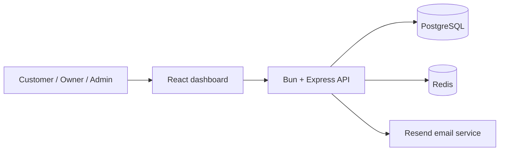
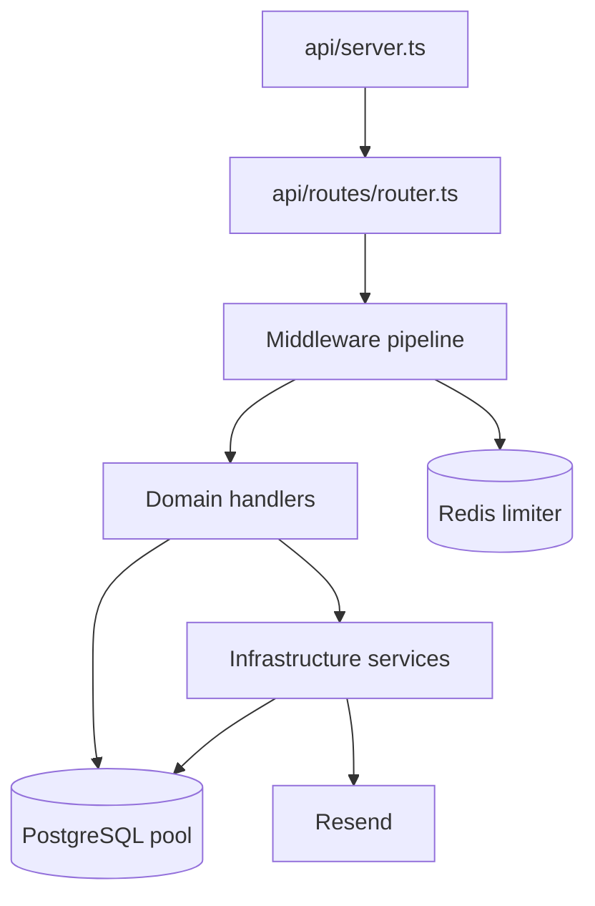
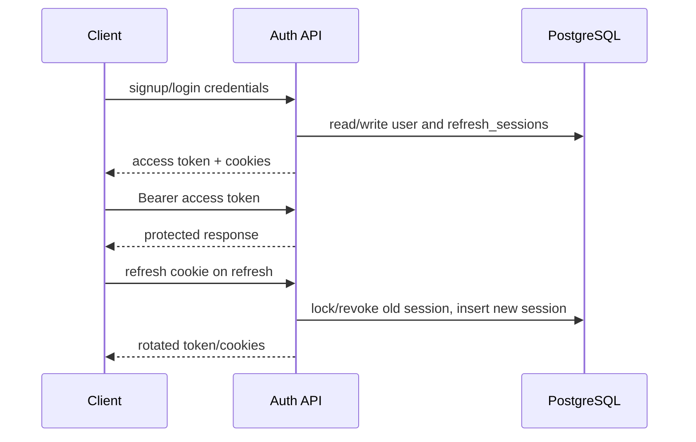
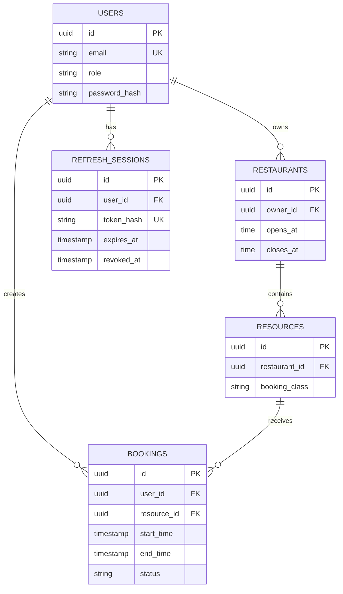

# DineSlot Architecture

## 1. Purpose

DineSlot is a modular monolith for restaurant table reservations. The backend is the system of record for identity, roles, restaurants, resources, bookings, status transitions, and refresh sessions. The dashboard is a React client that consumes the backend API.

**Architecture summary:** one deployable backend process owns the business rules and PostgreSQL access; Redis supports rate limiting; Resend handles asynchronous email delivery; the dashboard provides role-aware screens and API calls.

## 2. System Context



```text
[Customer / Owner / Admin]
          |
          v
[React dashboard]
          |
          | HTTPS + Bearer access token + credential cookies
          v
[Bun / Express API]
     |          |          |
     v          v          v
 [PostgreSQL] [Redis]   [Resend]
```

**Summary:** the browser never owns booking truth. It requests operations from the API, and the API validates and persists them in PostgreSQL.

## 3. Main Backend Architecture



```text
HTTP request
    |
    v
server.ts: CORS, Helmet, cookies, router
    |
    v
router.ts: method/path composition
    |
    +--> validate
    +--> rateLimiter
    +--> authenticate
    +--> requireRole
    |
    v
modules/*: request handlers and domain SQL
    |
    +--> configs/services: env, hashing, JWT, refresh tokens, email
    +--> PostgreSQL pool / transaction client
    +--> Redis or Resend where required
    |
    v
HTTP response
```

**Summary:** DineSlot uses layered organization inside a modular monolith. The route layer composes policies, the module layer performs business operations, and infrastructure modules provide external-system access. There is not yet a separate repository/service layer, so many handlers contain SQL and response policy directly.

## 4. Backend Layer Architecture

### 4.1 Application composition layer

**Files:** `Backend/src/api/server.ts`, `Backend/src/api/routes/router.ts`

- `server.ts` creates Express, configures CORS, proxy trust, cookies, Helmet, body parsing through the router, and startup DB connectivity.
- `router.ts` registers the root response and all auth, restaurant, resource, booking, and admin endpoints.
- The router is the composition boundary where authentication, roles, validation, and rate limiting are attached.

**Summary:** this layer decides which middleware and handler execute for each HTTP operation. It is the backend's public contract, so duplicate route registration and inconsistent path naming are important maintenance risks.

### 4.2 Middleware and request-policy architecture

**Files:** `authenticate.ts`, `requireRole.ts`, `validator.ts`, `rateLimiter.ts`, `csrf.ts`

```text
Request
  |
  +--> rateLimiter: Redis path/IP counter
  +--> validator: Zod body parsing
  +--> authenticate: verify access JWT -> req.userId
  +--> requireRole: query user role -> allow/403
  +--> handler ownership check where needed
  v
Domain operation
```

- `authenticate` establishes identity from a Bearer JWT.
- `requireRole` loads the current role from PostgreSQL and protects admin/owner mutations where attached.
- `validator` parses request bodies and replaces raw input with validated data.
- `rateLimiter` limits signup/login using Redis and fails open when Redis is unavailable.
- `csrf` contains a double-submit comparison but is not currently issued/wired across the mutation surface.

**Summary:** authentication and authorization are separate concepts, which is sound. Enforcement is still partly distributed between route middleware and individual handlers.

### 4.3 Authentication architecture



- Passwords use Argon2id.
- Access JWTs contain `userId` and expire after 15 minutes.
- Refresh tokens are opaque random values; only SHA-256 hashes are stored.
- The dashboard keeps the current access token in memory and uses an Axios 401 interceptor plus a refresh cookie for restoration/rotation.
- The current implementation also exposes token material to JavaScript and does not revoke the DB refresh session during logout.

**Summary:** basic login and rotation work, but the token model is mixed. The target should be one deliberate model: preferably HttpOnly refresh/access cookies with active CSRF protection, or a clearly defined Bearer-token model without redundant auth cookies.

### 4.4 Role and ownership architecture

```text
JWT userId
    |
    v
users.role lookup ------------------> admin route permission
    |
    v
handler ownership query ------------> restaurant/resource/booking permission
```

Roles are `customer`, `owner`, and `admin`.

- Admin routes use `requireRole(["admin"])`.
- Restaurant/resource mutations use owner role checks and restaurant ownership queries.
- Booking cancellation checks customer ownership or restaurant ownership.
- Booking status changes require an owner and update only a pending booking belonging to that owner.
- Frontend `ProtectedRoute` uses `allowedRoles`, but this is a UX guard; backend checks remain authoritative.

**Summary:** the authorization model is understandable and mostly implemented, but owner-booking reads should also have explicit owner middleware and role changes should invalidate or re-evaluate active sessions.

### 4.5 Validation architecture

**Files:** `auth.validator.ts`, `global_validator.ts`, `validator.ts`, handler-local Zod schemas.

```text
HTTP body / query / params
          |
          v
Zod schema at route or handler boundary
          |
     invalid -> 400
          |
          v
Validated values -> business checks -> SQL
```

Current business checks include:

- Signup name, email, password, mobile number, and customer/owner input policy.
- Restaurant name, optional address, and `HH:MM` opening/closing times.
- Booking UUIDs, ISO datetimes, ordering, 30-minute notice, 90-day horizon, 15-minute minimum, 4-hour maximum, and restaurant opening hours.
- Admin promotion and role-change payloads.

**Summary:** validation is present and booking rules are substantially stronger than before. Query/path validation and duplicate validation between middleware and handlers should be consolidated.

### 4.6 Restaurant and resource architecture

```text
Owner
  |
  +--> POST createRestaurant
  |        |
  |        v
  |    restaurants(owner_id, opens_at, closes_at)
  |
  +--> POST createResources
           |
           v
       resources(restaurant_id)
```

- Restaurants belong to users through `owner_id`.
- Resources represent bookable tables and retain table classification fields.
- Owners list their restaurants and resources.
- Public users list restaurants and public resources.
- The owner dashboard currently creates name/address but does not expose backend-supported opening-hour editing.

**Summary:** ownership and public browsing are separated correctly. The current API naming is functional but inconsistent, and resources have no update/delete workflow.

### 4.7 Booking architecture

```mermaid
sequenceDiagram
    participant Customer
    participant API
    participant DB as PostgreSQL
    participant Owner
    Customer->>API: create booking request
    API->>DB: validate resource/hours/time rules
    API->>DB: insert pending booking
    DB-->>API: commit or 23P01 conflict
    API-->>Customer: pending booking response
    API-->>Owner: notification request
    Owner->>API: confirm or reject
    API->>DB: update pending owned booking
    API-->>Customer: email notification request
```



Database guarantees:

- `chk_booking_time_order` requires `start_time < end_time`.
- `no_overlapping_bookings` uses `EXCLUDE USING gist` on resource and `tsrange(start_time, end_time)`.
- The exclusion applies only while status is not `cancelled`.
- `btree_gist` supports the UUID equality operator in the exclusion constraint.

Booking states:

```text
pending --owner confirm--> confirmed
pending --owner reject--> cancelled
pending/confirmed --customer or owner cancel--> cancelled
```

**Summary:** booking integrity is now enforced at the database layer, including concurrent requests. Remaining concerns are timezone semantics, status/cancellation race tests, and durable notification delivery.

### 4.8 Booking notification architecture

```text
Booking/status mutation
          |
          +--> database response returned immediately
          |
          `--> Resend sendEmail()
                    |
                    `--> failure logged; no retry/outbox state
```

`email.ts` provides templates for booking requested, confirmed, rejected, and cancelled messages. Booking creation, status updates, and cancellation call it without awaiting delivery.

**Summary:** notifications do not block core booking operations, but email delivery is not durable. A production design should use an outbox or job queue with retries and delivery state.

### 4.9 Persistence and migration architecture

- `db.ts` owns the PostgreSQL pool and startup connectivity check.
- Transaction-sensitive flows use a dedicated client where needed.
- `schema.sql` defines the `booking` schema, enum, tables, indexes, constraints, and admin seed update.
- `migrate.ts` executes the entire schema file in one operation.
- Foreign keys cascade user deletion to bookings and refresh sessions.

**Summary:** PostgreSQL is the source of truth and enforces important invariants. The migration file is not a versioned migration system and named constraints/repeated alterations are not safely idempotent on rerun.

### 4.10 Redis rate-limit architecture

```text
request path + client IP
          |
          v
Redis INCR ratelimit:<path>:<ip>
          |
          +--> first request: set expiry
          +--> over limit: 429
          `--> Redis error: allow request and log
```

**Summary:** Redis provides a simple distributed counter for signup/login protection. It currently fails open and is not applied to every sensitive endpoint.

## 5. Frontend Boundary

The frontend is intentionally summarized rather than treated as the primary architecture.

- `main.tsx` mounts `AuthProvider` and `App`.
- `AuthContext` restores sessions, stores the current user/token, and exposes auth state.
- `api.ts` injects the in-memory access token, sends cookies, and retries one 401 after refresh.
- `App.tsx` registers public, owner, customer, and admin routes.
- Pages call the backend endpoints directly.

**Summary:** the frontend is a page-level client over the backend API. It is initialized correctly at the top level, but `/login` navigation is missing, logout state cleanup is incomplete, page API code is duplicated, and no shared typed data layer exists.

## 6. Data Model



**Summary:** users own restaurants; restaurants contain resources; users create bookings for resources; refresh sessions belong to users. Booking rows snapshot table classification for historical consistency.

## 7. API Surface Summary

| Group | Current routes | Main protection |
|---|---|---|
| Auth | signup, login, refresh, me, logout | rate limit, JWT, refresh cookie |
| Restaurants | create, mine, public list | owner role for create, owner filter for mine |
| Resources | create, owner list, public list | owner role/ownership for create/list |
| Bookings | create, customer list, owner list, cancel, status update | JWT, ownership, owner role for status |
| Admin | promote, user list, role update, delete | admin role |

**Summary:** every business endpoint has a frontend caller or session mechanism; the root service response is intentionally backend-only. Endpoint names should be standardized before treating the API as a stable public contract.

## 8. Implemented vs Remaining

### Implemented

- Modular Bun/Express backend and React/Vite dashboard.
- PostgreSQL schema with users, roles, restaurants, resources, bookings, and refresh sessions.
- Argon2id password hashing and JWT access tokens.
- Opaque refresh tokens stored as hashes.
- Owner/admin route authorization and ownership checks on core mutations.
- Restaurant opening-hours validation.
- Booking notice, horizon, duration, and ordering validation.
- PostgreSQL GiST exclusion constraint for concurrent non-overlap.
- Customer booking history and cancellation.
- Owner booking confirmation/rejection/cancellation.
- Resend notification templates and calls.
- Redis-backed signup/login rate limiting.
- Frontend page registration, role-aware guards, silent refresh, and Axios retry behavior.

### Remaining

1. Remove duplicate restaurant route registration.
2. Standardize API paths and update README/dashboard/tests together.
3. Make logout revoke the database refresh session and clear all client auth state.
4. Decide on one token transport; add active CSRF protection if cookie auth remains.
5. Implement refresh-token reuse detection and `replaced_by` linkage.
6. Make schema migration reruns safely idempotent.
7. Add durable email delivery with retry/outbox/audit state.
8. Add owner opening-hour editing, pagination, route fallback, shared typed API utilities, and consistent logout navigation.
9. Add backend and frontend automated tests.

**Status summary:** core product architecture and booking integrity are implemented. Security hardening, API cleanup, notification durability, operational tooling, and automated verification remain open.

## 9. Architecture Decisions

- **Modular monolith:** appropriate for the current scope; avoids distributed-system overhead.
- **PostgreSQL as authority:** business invariants such as booking overlap must survive concurrent requests and alternate write paths.
- **Snapshot booking classifications:** preserves historical booking meaning if a resource's classification changes.
- **Separate authentication and authorization:** identity comes from JWT; role and ownership are evaluated separately.
- **Database exclusion constraint:** stronger than an application-only overlap check.
- **Asynchronous email side effects:** keeps booking/status responses fast, but requires durable delivery before production scale.

## 10. Final Architecture Summary

DineSlot is a TypeScript modular monolith with a layered HTTP boundary, role-aware domain handlers, PostgreSQL-backed persistence, Redis rate limiting, and Resend notifications. The central architectural strength is that booking overlap is enforced in PostgreSQL rather than trusted to the browser or a single application code path. The central architectural weakness is that several cross-cutting concerns remain distributed across handlers and pages: token lifecycle, CSRF, route naming, pagination, notification durability, and error handling.

The architecture is suitable for continued feature development. Before production hardening, complete the remaining items in Section 8 and add integration tests around authentication, authorization, migration reruns, booking conflicts, status races, and notification failure handling.
