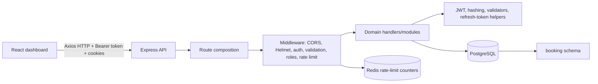
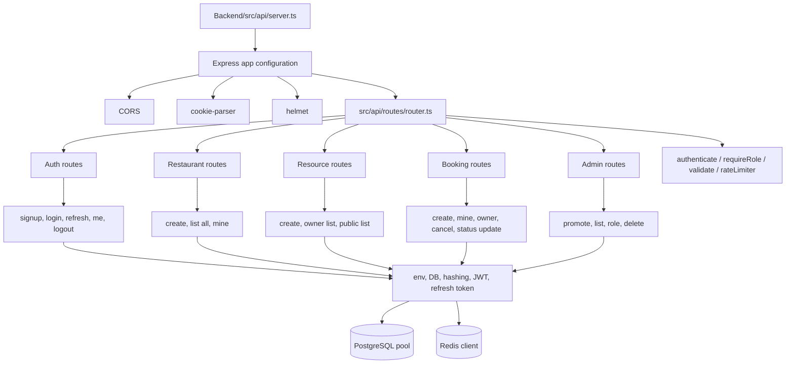
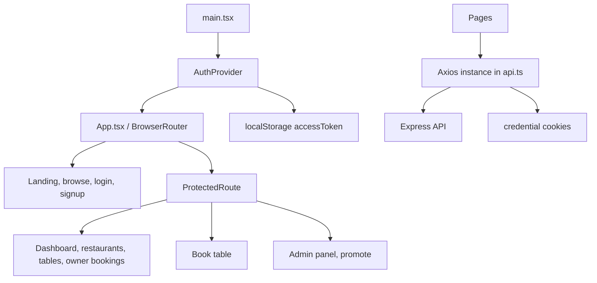
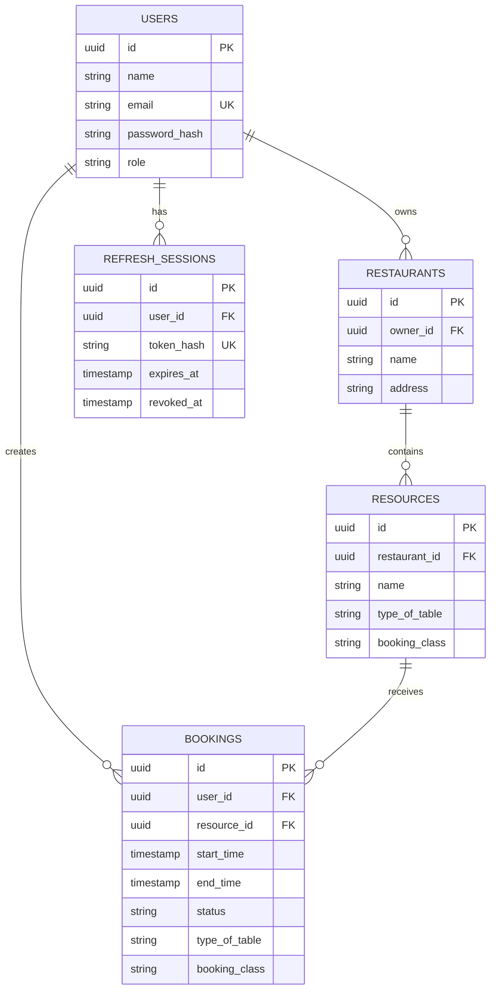
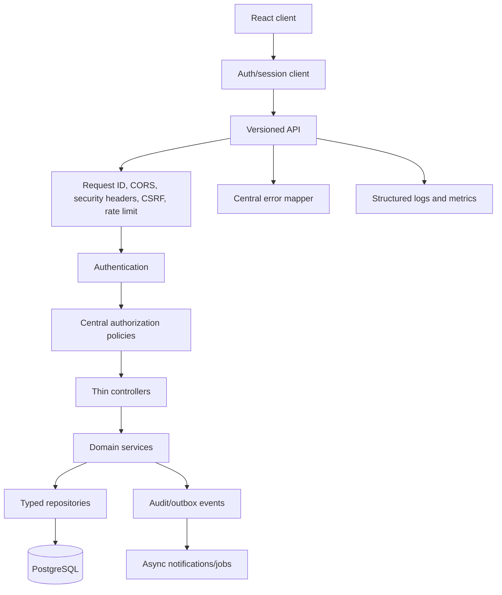

# DineSlot Codebase Report

## Index

- [1. Executive Summary](#1-executive-summary)
- [1.1 Tech Stack Observed](#11-tech-stack-observed)
- [2. System Architecture](#2-system-architecture)
  - [2.1 Main architecture](#21-main-architecture)
  - [2.2 Backend architecture](#22-backend-architecture)
  - [2.3 Frontend architecture](#23-frontend-architecture)
  - [2.4 Main 2D request flow](#24-main-2d-request-flow)
- [3. Repository and Runtime Structure](#3-repository-and-runtime-structure)
  - [3.1 Complete codebase structure](#31-complete-codebase-structure)
  - [3.2 File-by-file working](#32-file-by-file-working)
- [4. Data Architecture](#4-data-architecture)
  - [4.1 Database model](#41-database-model)
  - [4.2 Persistence micro-architecture](#42-persistence-micro-architecture)
- [5. End-to-End Flow Summaries](#5-end-to-end-flow-summaries)
- [6. Micro-Architecture Summaries](#6-micro-architecture-summaries)
- [7. Confirmed Drawbacks and Risks](#7-confirmed-drawbacks-and-risks)
- [8. Recommended Target Architecture](#8-recommended-target-architecture)
- [9. Suggested Test Matrix](#9-suggested-test-matrix)
- [10. Expected Flow vs Current Flow](#10-expected-flow-vs-current-flow)
- [11. Backend Endpoint vs Frontend Coverage](#11-backend-endpoint-vs-frontend-coverage)
- [12. Frontend Page Integration Audit](#12-frontend-page-integration-audit)
- [13. Verification Notes](#13-verification-notes)
- [14. Final Coverage Checklist](#14-final-coverage-checklist)

## 1. Executive Summary

DineSlot is a two-part restaurant table-booking system:

- `Backend/`: a Bun + TypeScript + Express HTTP API backed by PostgreSQL, with Redis used by the rate limiter.
- `dashboard/`: a React 19 + TypeScript + Vite single-page application using React Router and Axios.

The intended business flow is:

1. A customer or owner signs up or logs in.
2. An owner creates restaurants and tables/resources.
3. A visitor browses public restaurants and resources.
4. An authenticated customer creates a booking for a resource and time range.
5. Customers and restaurant owners view or cancel bookings.
6. Administrators list users, change roles, promote users, or delete users.

The repository has a reasonable high-level separation between HTTP routing, domain handlers, infrastructure services, and persistence. The current implementation has improved since the earlier audit: owner authorization is applied to the main owner routes, resource listing works, booking time rules exist, PostgreSQL now enforces non-overlap, customer booking history exists, and owner approval/rejection with email notifications has been added. The main remaining weaknesses are API contract drift, duplicated route registration, incomplete token/CSRF/session invalidation design, mixed time-zone handling, unpaginated owner/admin lists, and notification reliability/audit gaps.

### 1.1 Tech Stack Observed

| Area | Technology | How it is used |
|---|---|---|
| Backend runtime | Bun | Runs the backend through `bun run src/api/server.ts`; also used by the migration script. |
| Backend language | TypeScript | Backend source, strict compiler configuration, and typed Express handlers. |
| HTTP framework | Express 5 | Creates the API server, router, middleware pipeline, and HTTP handlers. |
| Database | PostgreSQL | Stores users, restaurants, resources, bookings, and refresh sessions. |
| Database driver | `pg` | Provides the PostgreSQL connection pool and transaction clients. |
| Cache/infrastructure | Redis via `ioredis` | Stores IP/path rate-limit counters. |
| Authentication | JSON Web Tokens via `jsonwebtoken` | Signs short-lived access tokens. |
| Refresh-token security | Node/Bun `crypto` SHA-256 hashing | Generates opaque refresh tokens and stores only their hashes. |
| Password hashing | Argon2 via `argon2` | Hashes and verifies user passwords with Argon2id. |
| Email delivery | Resend via `resend` | Sends fire-and-forget booking-request, confirmation, rejection, and cancellation emails. |
| Request validation | Zod | Validates authentication, restaurant, resource, booking, promotion, and role payloads. |
| HTTP security | `helmet`, `cors`, `cookie-parser` | Security headers, cross-origin policy, and cookie parsing. |
| Rate limiting | `express-rate-limit` is listed, custom Redis limiter is used | The active implementation is the custom `rateLimiter` middleware backed by Redis. |
| Frontend framework | React 19 | Builds the dashboard SPA and page components. |
| Frontend language | TypeScript | React components, context, API helpers, and route definitions. |
| Frontend build tool | Vite | Development server and production bundling. |
| Frontend routing | React Router DOM 7 | Public, protected, owner, customer, and admin routes. |
| Frontend HTTP client | Axios | API requests, Bearer headers, and credential cookies. |
| Frontend styling | Tailwind CSS 4 plus custom CSS | Utility classes, theme variables, and the admin-console stylesheet. |
| Frontend deployment target visible in code | Vercel/Railway URLs | The dashboard contains a Vercel origin and the API client points to a Railway backend in production. |
| Container/deployment configuration | Dockerfile and Railway-oriented configuration | The backend includes a Dockerfile and deployment-oriented environment variables. |

**Tech-stack summary:** DineSlot is a TypeScript modular monolith with a Bun/Express backend, PostgreSQL persistence, Redis-assisted rate limiting, and a React/Vite dashboard. It is not currently a microservices system; the backend modules are internal application modules that run in one server process.

## 2. System Architecture

### 2.1 Main architecture



**Main architecture summary:** This is a modular monolith. The dashboard is a separately deployed SPA, while the backend owns business operations and direct SQL persistence. There is no separate service layer or repository abstraction between handlers and PostgreSQL; most modules perform SQL directly. This keeps the code small and easy to follow, but makes validation, authorization, transaction policy, error handling, and response contracts inconsistent across modules.

### 2.2 Backend architecture



**Backend architecture summary:** `server.ts` is the composition root. `router.ts` maps URL methods to handlers and attaches selected middleware. `modules/` contains controller-like request handlers. `infrastructure/` contains configuration, SQL connection, Redis connection, and security helpers. The SQL schema is applied by a standalone migration script that executes the whole schema file.

### 2.3 Frontend architecture



**Frontend architecture summary:** The SPA has page-level components with local state and direct Axios calls. `AuthContext` stores the access token in `localStorage`; `ProtectedRoute` verifies it by calling `/api/auth/me`. There is no shared data-fetching layer, typed API client, global error boundary, refresh interceptor, role guard, or form-validation library. This is straightforward for a small prototype but causes repeated request logic and makes auth expiry and API contract changes difficult to manage safely.

### 2.4 Main 2D request flow

The following plain-text diagram is intentionally readable without Mermaid support:

```text
 [User browser]
   |
   | React page + Axios request
   v
 [dashboard/src/api.ts]
   |
   | HTTP: /api/...
   | Authorization: Bearer access token
   | refresh/access cookies also sent when applicable
   v
 [Express server.ts]
   |
   +--> CORS / Helmet / cookie-parser
   |
   v
 [router.ts]
   |
   +--> validation       +--> rate limiter
   +--> authenticate     +--> requireRole
   |
   v
 [domain handler in modules/]
   |
   +--> SQL query / transaction ------------------+
   |                                               |
   v                                               v
 [PostgreSQL booking schema]                    [Redis counters]
   |
   v
 [JSON response] --> [React state] --> [screen update]
```

**2D flow summary:** Every feature follows the same broad path, but middleware and authorization vary by route. The missing central service/repository boundary is why SQL, response formatting, and policy checks are repeated inside handlers.

## 3. Repository and Runtime Structure

### Backend entry and configuration

- `Backend/src/api/server.ts` creates the Express application, configures CORS, cookies, Helmet, and the router, then connects to PostgreSQL before listening.
- `Backend/index.ts` only prints `Hello via Bun!`; it is not the actual server entry despite `package.json` declaring it as the package module.
- `Backend/package.json` starts with `bun run src/api/server.ts` and does not define build, test, lint, or migration scripts.
- `Backend/src/infrastructure/configs/env.ts` loads `.env`, validates required variables with Zod, and exports typed configuration.
- `Backend/src/infrastructure/DB/db.ts` creates a PostgreSQL pool and checks connectivity during startup.
- `Backend/src/infrastructure/DB/Redis.ts` creates a Redis client used by rate limiting.

### Frontend entry and configuration

- `dashboard/src/main.tsx` mounts the app and wraps it in `AuthProvider`.
- `dashboard/src/App.tsx` defines public and protected React Router routes.
- `dashboard/src/api.ts` creates an Axios client with a production Railway URL, a local URL, and `withCredentials: true`.
- `dashboard/package.json` defines `dev`, `build`, `lint`, and `preview` scripts.
- `dashboard/vite.config.ts` enables React and Tailwind Vite plugins.
- `dashboard/src/index.css` defines Tailwind theme values plus a large custom admin-console stylesheet.

### 3.1 Complete codebase structure

The following inventory includes every source, configuration, documentation, and deployment filename present in the attached `Backend/` and `dashboard/` structures. Empty `assets/` and `public/` directories are also shown because they are part of the project layout.

```text
DineSlot/
|-- LICENSE
|-- README.md
|-- report.md
|-- Backend/
|   |-- .env
|   |-- .gitignore
|   |-- bun.lock
|   |-- dockerfile
|   |-- example.env
|   |-- index.ts
|   |-- package.json
|   |-- README.md
|   |-- tsconfig.json
|   `-- src/
|       |-- api/
|       |   |-- server.ts
|       |   |-- middleware/
|       |   |   |-- authenticate.ts
|       |   |   |-- csrf.ts
|       |   |   |-- rateLimiter.ts
|       |   |   |-- requireRole.ts
|       |   |   `-- validator.ts
|       |   `-- routes/
|       |       `-- router.ts
|       |-- infrastructure/
|       |   |-- configs/
|       |   |   |-- env.ts
|       |   |   `-- hashing.ts
|       |   |-- DB/
|       |   |   |-- db.ts
|       |   |   |-- Redis.ts
|       |   |   |-- scripts/
|       |   |   |   `-- migrate.ts
|       |   |   `-- SQL/
|       |   |       `-- schema.sql
|       |   `-- services/
|       |       |-- auth.validator.ts
|       |       |-- email.ts
|       |       |-- global_validator.ts
|       |       |-- jwt.ts
|       |       `-- refreshToken.ts
|       `-- modules/
|           |-- admin/
|           |   |-- delete.ts
|           |   |-- promote.ts
|           |   |-- users.list.ts
|           |   `-- users.setRole.ts
|           |-- auth/
|           |   |-- logout.ts
|           |   |-- me.ts
|           |   `-- refresh.ts
|           |-- Booking/
|           |   |-- booking.cancel.ts
|           |   |-- Booking.create.ts
|           |   |-- booking.get.ts
|           |   |-- booking.updateStatus.ts
|           |   `-- get.owner.booking.ts
|           |-- login/
|           |   `-- login.ts
|           |-- resources/
|           |   |-- resource.getAll.ts
|           |   |-- resources.create.ts
|           |   `-- resources.get.ts
|           |-- restaurant/
|           |   |-- restaurant.create.ts
|           |   |-- restaurant.getAll.ts
|           |   `-- restaurant.mine.ts
|           `-- signup/
|               `-- signup.ts
|-- dashboard/
|   |-- .env
|   |-- .env.example
|   |-- .gitignore
|   |-- eslint.config.js
|   |-- index.html
|   |-- package.json
|   |-- README.md
|   |-- tsconfig.app.json
|   |-- tsconfig.json
|   |-- tsconfig.node.json
|   |-- vite.config.ts
|   |-- public/
|   |   |-- favicon.svg
|   |   `-- icons.svg
|   `-- src/
|       |-- api.ts
|       |-- App.tsx
|       |-- index.css
|       |-- main.tsx
|       |-- assets/
|       |   |-- hero.png
|       |   |-- react.svg
|       |   `-- vite.svg
|       |-- components/
|       |   `-- protectedRoutes.tsx
|       |-- context/
|       |   `-- AuthContext.tsx
|       `-- pages/
|           |-- AdminPanel.tsx
|           |-- AdminPromote.tsx
|           |-- BookTables.tsx
|           |-- BrowseRestaurants.tsx
|           |-- BrowseRestaurantTables.tsx
|           |-- Dashboard.tsx
|           |-- LandingChoice.tsx
|           |-- Login.tsx
|           |-- MyBookings.tsx
|           |-- OwnerBookings.tsx
|           |-- restaurants.mine.tsx
|           |-- RestaurantTables.tsx
|           `-- Signup.tsx
```

### 3.2 File-by-file working

#### Root files

| File | Working |
|---|---|
| `LICENSE` | Repository licensing text; does not participate in runtime behavior. |
| `README.md` | Project-level product description, intended architecture, API examples, limitations, and local setup instructions. Some statements are stale compared with the implementation; see Section 10. |
| `report.md` | This codebase analysis, architecture description, flow comparison, drawbacks, and remediation report. |

#### Backend configuration and entry files

| File | Working |
|---|---|
| `Backend/.env` | Local runtime secrets/configuration; should remain private and never be committed. |
| `Backend/.gitignore` | Git exclusions for backend-generated or secret files. |
| `Backend/bun.lock` | Bun dependency lockfile pinning resolved backend package versions. |
| `Backend/dockerfile` | Container build/run instructions for deploying the backend. |
| `Backend/example.env` | Template listing environment variables required by the backend. |
| `Backend/index.ts` | Bun scaffold entry that prints a greeting; it is not the active HTTP server entry. |
| `Backend/package.json` | Declares backend dependencies and the `start` script, which runs `src/api/server.ts`. |
| `Backend/README.md` | Bun-generated backend setup notes; currently says to run `index.ts`, which conflicts with the package start script. |
| `Backend/tsconfig.json` | Backend TypeScript compiler settings: strict checking, Bun types, bundler resolution, and no emit. |

#### Backend API and middleware

| File | Working |
|---|---|
| `Backend/src/api/server.ts` | Creates Express, configures CORS, proxy trust, cookies, Helmet, mounts the router, connects PostgreSQL, and starts listening. |
| `Backend/src/api/routes/router.ts` | Registers health/root, auth, restaurant, resource, booking, and admin endpoints and attaches route middleware. |
| `Backend/src/api/middleware/authenticate.ts` | Reads a Bearer access token, verifies the JWT, and adds `userId` to the request. |
| `Backend/src/api/middleware/csrf.ts` | Compares a CSRF cookie with the `x-csrf-token` header; currently not issued or wired to mutations. |
| `Backend/src/api/middleware/rateLimiter.ts` | Builds Redis counters by request path and IP and rejects requests above the configured threshold; fails open if Redis errors. |
| `Backend/src/api/middleware/requireRole.ts` | Loads the current database role and permits only configured roles. |
| `Backend/src/api/middleware/validator.ts` | Generic Zod middleware that validates and replaces `req.body` with parsed data. |

#### Backend infrastructure and services

| File | Working |
|---|---|
| `Backend/src/infrastructure/configs/env.ts` | Loads `.env`, validates required environment variables with Zod, and exports typed `env`. |
| `Backend/src/infrastructure/configs/hashing.ts` | Hashes and verifies passwords with Argon2id. |
| `Backend/src/infrastructure/DB/db.ts` | Creates the PostgreSQL connection pool and performs the startup connectivity check. |
| `Backend/src/infrastructure/DB/Redis.ts` | Creates the shared ioredis client and logs connection/error events. |
| `Backend/src/infrastructure/DB/scripts/migrate.ts` | Reads `schema.sql`, executes it against PostgreSQL, and closes the pool. |
| `Backend/src/infrastructure/DB/SQL/schema.sql` | Creates the `booking` schema, enum, users, restaurants, resources, bookings, refresh sessions, indexes, and admin seed update. |
| `Backend/src/infrastructure/services/auth.validator.ts` | Defines signup and login Zod schemas. |
| `Backend/src/infrastructure/services/email.ts` | Creates the Resend client, formats booking times, defines request/confirmation/rejection/cancellation email templates, and sends notifications without awaiting delivery. |
| `Backend/src/infrastructure/services/global_validator.ts` | Defines restaurant, resource, booking, promotion, and role-change schemas. |
| `Backend/src/infrastructure/services/jwt.ts` | Generates and verifies 15-minute access JWTs. |
| `Backend/src/infrastructure/services/refreshToken.ts` | Generates opaque refresh tokens and hashes them with SHA-256 for storage. |

#### Backend domain modules

| File | Working |
|---|---|
| `Backend/src/modules/signup/signup.ts` | Validates and creates users, hashes passwords, creates refresh sessions, sets cookies, and returns the access token/user. |
| `Backend/src/modules/login/login.ts` | Validates credentials, verifies the password, creates access/refresh tokens, stores the refresh session, and returns the user/session result. |
| `Backend/src/modules/auth/logout.ts` | Clears access and refresh cookies; it does not revoke the stored refresh session or update frontend localStorage. |
| `Backend/src/modules/auth/me.ts` | Returns the authenticated user's id, name, email, and role. |
| `Backend/src/modules/auth/refresh.ts` | Locks a refresh session, checks expiry/revocation, rotates tokens, and writes new cookies. |
| `Backend/src/modules/restaurant/restaurant.create.ts` | Validates and inserts a restaurant owned by `req.userId`, including optional opening and closing times; the active route applies owner authorization. |
| `Backend/src/modules/restaurant/restaurant.getAll.ts` | Returns the public restaurant list. |
| `Backend/src/modules/restaurant/restaurant.mine.ts` | Returns restaurants owned by the authenticated user. |
| `Backend/src/modules/resources/resources.create.ts` | Validates a resource, checks restaurant ownership, and inserts the table/resource. |
| `Backend/src/modules/resources/resources.get.ts` | Validates the restaurant query, checks ownership against `booking.restaurants`, and returns the owned resource list. |
| `Backend/src/modules/resources/resource.getAll.ts` | Returns public resources for a supplied restaurant query parameter. |
| `Backend/src/modules/Booking/Booking.create.ts` | Validates booking input, checks overlap inside a transaction, inserts a pending booking, and commits. |
| `Backend/src/modules/Booking/booking.get.ts` | Returns bookings belonging to the authenticated customer. |
| `Backend/src/modules/Booking/booking.cancel.ts` | Checks customer/restaurant-owner authority and changes a booking to cancelled. |
| `Backend/src/modules/Booking/booking.updateStatus.ts` | Lets the owning restaurant owner confirm or reject pending bookings and triggers a customer email notification. |
| `Backend/src/modules/Booking/get.owner.booking.ts` | Returns bookings for restaurants owned by the authenticated user. |
| `Backend/src/modules/admin/promote.ts` | Promotes a user identified by email to owner; admin-only at the route. |
| `Backend/src/modules/admin/users.list.ts` | Returns all users for the admin panel. |
| `Backend/src/modules/admin/users.setRole.ts` | Changes a user's role after validating the user id and role. |
| `Backend/src/modules/admin/delete.ts` | Deletes a user by email; database cascades remove related bookings and refresh sessions. |

#### Dashboard configuration and entry files

| File | Working |
|---|---|
| `dashboard/.env` | Local frontend environment values; may contain deployment-specific configuration. |
| `dashboard/.env.example` | Documents the intended `VITE_API_URL` frontend environment variable. |
| `dashboard/.gitignore` | Git exclusions for frontend dependencies, build output, and local files. |
| `dashboard/package-lock.json` | npm dependency lockfile for the dashboard; it should be kept consistent with the package manager used for installs. |
| `dashboard/eslint.config.js` | ESLint flat configuration for TypeScript, React hooks, and React refresh rules. |
| `dashboard/index.html` | Vite HTML shell containing the root element loaded by React. |
| `dashboard/package.json` | Frontend dependencies and `dev`, `build`, `lint`, and `preview` scripts. |
| `dashboard/README.md` | Vite starter documentation; does not fully document DineSlot's current application flows. |
| `dashboard/tsconfig.app.json` | TypeScript settings for application source and JSX. |
| `dashboard/tsconfig.json` | Project-level TypeScript references/configuration. |
| `dashboard/tsconfig.node.json` | TypeScript settings for Vite/configuration-side files. |
| `dashboard/vite.config.ts` | Enables the React and Tailwind Vite plugins. |
| `dashboard/public/favicon.svg` | Browser tab/site icon served as a static public asset. |
| `dashboard/public/icons.svg` | Static SVG icon asset available directly from the public directory. |

#### Dashboard shared source

| File | Working |
|---|---|
| `dashboard/src/api.ts` | Creates the Axios client, sets production/local base URLs, and enables credential cookies. |
| `dashboard/src/App.tsx` | Defines BrowserRouter routes for public, protected, owner, customer, and admin screens. |
| `dashboard/src/index.css` | Imports Tailwind, declares theme variables, base styles, animations, and the admin console stylesheet. |
| `dashboard/src/main.tsx` | Mounts React and wraps the application in `AuthProvider`. |
| `dashboard/src/assets/hero.png` | Raster hero visual imported/available for frontend presentation. |
| `dashboard/src/assets/react.svg` | Vite/React starter SVG asset. |
| `dashboard/src/assets/vite.svg` | Vite starter SVG asset. |
| `dashboard/src/components/protectedRoutes.tsx` | Checks for an access token and calls `/auth/me` before rendering protected content. |
| `dashboard/src/context/AuthContext.tsx` | Stores the access token in React state and localStorage and exposes `useAuth`. |

#### Dashboard pages

| File | Working |
|---|---|
| `dashboard/src/pages/LandingChoice.tsx` | Public landing/choice screen with navigation, promotional content, and interactive visual effects. |
| `dashboard/src/pages/Login.tsx` | Login form, access-token storage, role lookup, and role-based navigation after login. |
| `dashboard/src/pages/Signup.tsx` | Signup form for customer/owner roles, access-token storage, and post-signup navigation. |
| `dashboard/src/pages/MyBookings.tsx` | Customer booking-history screen showing pending/confirmed/cancelled status and allowing future pending/confirmed cancellations. |
| `dashboard/src/pages/BrowseRestaurants.tsx` | Public restaurant list; optionally loads the current role to show owner/admin navigation. |
| `dashboard/src/pages/BrowseRestaurantTables.tsx` | Public resource/table list for one restaurant and navigation to booking. |
| `dashboard/src/pages/BookTables.tsx` | Protected booking form that converts date/time input and creates a booking. |
| `dashboard/src/pages/Dashboard.tsx` | Owner-oriented dashboard with links to restaurants/bookings and logout action. |
| `dashboard/src/pages/restaurants.mine.tsx` | Loads the authenticated user's restaurants and creates new restaurants. |
| `dashboard/src/pages/RestaurantTables.tsx` | Loads an owner's resources and provides a table/resource creation form; current API paths do not align with the backend. |
| `dashboard/src/pages/OwnerBookings.tsx` | Loads owner bookings and allows cancellation of non-cancelled bookings. |
| `dashboard/src/pages/AdminPanel.tsx` | Admin user table with filtering, sorting, optimistic role updates, and optimistic deletion. |
| `dashboard/src/pages/AdminPromote.tsx` | Admin form that promotes a user to owner by email. |

**Structure summary:** The codebase is organized as one backend application and one frontend application. Backend files divide into HTTP composition, middleware, infrastructure, and domain modules. Dashboard files divide into application bootstrapping, shared auth/networking, and page-level workflows. The structure is understandable, but naming and route conventions are inconsistent and the page layer currently owns too much networking and business-flow logic.

## 4. Data Architecture

### 4.1 Database model



**Data architecture summary:** PostgreSQL is the source of truth. Users have roles (`customer`, `owner`, `admin`). Restaurants belong to owners and have opening/closing times, resources belong to restaurants, and bookings belong to both users and resources. Booking classification is intentionally snapshotted into the booking row. PostgreSQL now enforces valid time ordering and non-overlapping non-cancelled bookings with a GiST exclusion constraint. Refresh sessions store hashes rather than raw refresh tokens, but lifecycle and reuse controls remain incomplete.

### 4.2 Persistence micro-architecture

- `Pool`: handlers normally call `db.query`; booking creation and refresh rotation explicitly acquire a client for transactions.
- `Migration`: `scripts/migrate.ts` reads and executes the entire SQL schema file. It logs errors but does not set a failing process exit code.
- `Schema evolution`: the schema uses `CREATE IF NOT EXISTS` and `ALTER TABLE ... ADD COLUMN IF NOT EXISTS`, which is convenient for local setup but is not a structured versioned migration system.
- `Refresh sessions`: rotation revokes the old row and inserts a new row inside a transaction. The schema has `replaced_by`, but the rotation code does not populate it, token-family reuse detection is not implemented, and logout does not revoke the active database session.
- `Booking constraint`: `btree_gist` plus `EXCLUDE USING gist` prevents overlapping non-cancelled bookings for the same resource at the database layer. This is stronger than the earlier application-only overlap check.
- `Notification side effect`: booking creation, owner status changes, and cancellation respond before calling Resend; email failures are logged but are not retried or persisted as durable notification jobs.
- `Redis`: the rate limiter increments `ratelimit:<path>:<ip>` and sets expiry on the first request. It fails open when Redis is unavailable.

## 5. End-to-End Flow Summaries

### 5.1 Sign-up flow

1. The dashboard `Signup` page sends name, email, mobile number, password, and a customer/owner role.
2. The route applies the Redis rate limiter and `validate(registerSchema)`.
3. `signup.ts` checks email existence, hashes the password with Argon2id, inserts the user, creates an opaque refresh token session, and sets access/refresh cookies.
4. It also returns the access token in JSON; the dashboard puts that token into `localStorage`.
5. The frontend navigates owners to `/dashboard` and customers to `/browse`.

**Summary:** The flow has layered validation and secure password hashing, but role selection is client-controlled for `customer` or `owner`, duplicate checks are not paired with a `23505` recovery path, and tokens are simultaneously in cookies and JavaScript storage. Owner onboarding policy must be explicit.

### 5.2 Login flow

1. The dashboard sends credentials to `/api/auth/login`.
2. The route rate-limits and validates the request.
3. `login.ts` looks up the user, verifies the Argon2 hash, creates access and refresh tokens, stores the refresh hash, and sets cookies.
4. The JSON access token is stored in `localStorage`.
5. The dashboard calls `/api/auth/me` to obtain the role, then routes to admin, owner, or customer screens.

**Summary:** Login avoids user-enumeration messages and uses a strong password verifier. Its main architectural weakness is the cookie/localStorage dual model, which increases security and state-consistency complexity.

### 5.3 Protected request flow

1. The frontend reads the token from `AuthContext` and sends `Authorization: Bearer <token>`.
2. `authenticate` verifies the JWT signature and expiration and sets `req.userId`.
3. Some routes then use `requireRole`, which performs a live role lookup in PostgreSQL.
4. Handlers perform ownership checks when implemented.

**Summary:** Authentication and authorization are conceptually separated, which is good, but route-level role enforcement is incomplete and client-side protection is not an authorization boundary.

### 5.4 Refresh flow

1. The browser sends the refresh cookie to `/api/auth/refresh`.
2. `refreshRotation` hashes it, locks the matching session row, checks revocation and expiry, revokes it, inserts a new session, and sets new cookies.

**Summary:** This is the strongest transaction-oriented security flow in the backend. It still lacks CSRF protection, token-family reuse detection, `replaced_by` linkage, cleanup of expired sessions, and a frontend interceptor that actually invokes refresh on access-token expiry.

### 5.5 Logout flow

1. The dashboard calls `/api/auth/logout` with Axios credentials.
2. The handler calls `clearCookie` for access and refresh cookies.

**Summary:** Logout clears browser cookies only. It does not revoke the stored refresh session, and the `AuthContext` token in localStorage is also not cleared, so the UI may remain logically authenticated until a later failure. The exact browser behavior of `clearCookie` is not treated as a confirmed defect here; the confirmed issue is missing server-side session revocation and client-state cleanup.

### 5.6 Restaurant-owner flow

1. An owner creates a restaurant through `CreateRestaurant`.
2. The owner lists restaurants through `getMyRestaurant`.
3. The owner opens a restaurant tables page.
4. The page fetches owned resources and submits a new resource.

**Summary:** The current resource create/list flow now checks owner access and returns resources correctly. The remaining issue is contract naming: the dashboard and backend use `/resources/createResources`, while the README describes a different REST-style path.

### 5.7 Public browsing flow

1. `/browse` requests all restaurants without authentication.
2. `/browse/:restaurantId` requests public resources for the selected restaurant.
3. The user selects a resource and is sent to the protected booking page.

**Summary:** The public flow is simple and matches the intended product journey. The public resource endpoint accepts an unvalidated query string and does not first verify that the restaurant exists, though the parameterized query prevents SQL injection.

### 5.8 Booking creation flow

1. The booking page converts local date/time input to JavaScript ISO strings.
2. The backend validates UUID, ordering, 30-minute notice, 90-day horizon, and 15-minute-to-4-hour duration rules.
3. The backend checks that the requested time falls within the restaurant's opening hours.
4. PostgreSQL's GiST exclusion constraint rejects overlaps for the same resource while cancelled bookings are excluded.
5. The API returns a pending booking and fire-and-forget customer/owner notification requests.

**Summary:** The current database design now provides the intended concurrent no-overlap guarantee more reliably than the earlier application-only check. Remaining concerns are timezone interpretation, lack of durable email delivery, and whether status changes and notifications are audited.

### 5.9 Booking read and cancel flow

- Customers get paginated bookings from `booking.get.ts` and view/cancel them in `MyBookings.tsx`.
- Owners get bookings for restaurants they own from `get.owner.booking.ts`.
- Owners confirm or reject pending bookings through `booking.updateStatus.ts`.
- A customer or restaurant owner may cancel future pending/confirmed bookings through `booking.cancel.ts`.

**Summary:** Status and future-time checks are now enforced in the cancellation update, and owner confirmation/rejection is scoped to owned pending bookings. The update-plus-notification operations are still not one durable transaction, owner listings are not paginated, and the separate fallback lookup makes cancellation behavior more complex.

### 5.10 Administration flow

1. Admin routes use `authenticate` and `requireRole(["admin"])`.
2. Admins list users, promote by email, change roles by UUID, or delete by email.
3. `AdminPanel` performs local filtering, sorting, optimistic role changes, and optimistic deletion.

**Summary:** The backend admin role check is the correct source of authority. The frontend route itself only checks that a token exists, so a non-admin can open the page and only discovers the denial on the API call. User deletion cascades bookings and sessions through foreign keys, but the destructive blast radius is not clearly surfaced in the backend response or audit trail.

## 6. Micro-Architecture Summaries

### Authentication and authorization

- JWT access token contains only `userId` and is verified with the access secret.
- Role is fetched from PostgreSQL per protected role-gated request.
- Ownership is usually checked inside domain handlers rather than centralized policy functions.
- Frontend uses token presence plus `/me` for route gating.

**Assessment:** The separation of identity, role lookup, and ownership is understandable, but policy is scattered and the frontend guard is not security. Add a consistent authorization policy layer and server-side role restrictions to every owner/admin operation.

```text
 [Login/signup]
   |
   v
 [Argon2 password check/hash]
   |
   +--> [15-minute JWT] ------> returned JSON -> localStorage -> Bearer header
   |
   +--> [opaque refresh token] -> cookie -> SHA-256 hash in refresh_sessions
              |
              v
          [refresh rotation]
```

**Micro-diagram summary:** The access token and refresh token travel through different mechanisms, but the access token is still exposed to JavaScript and the refresh cookie is not HttpOnly. This dual model should be simplified.

### Validation

- Zod schemas exist for auth, restaurants, resources, bookings, promotions, and role changes.
- Signup and login are validated twice: route middleware and handler-level `safeParse`.
- Several handlers validate manually or do not validate query/path parameters.

**Assessment:** Validation exists but is not consistently applied. Prefer one validated boundary per request and validate IDs, query parameters, date ordering, and business ranges centrally.

```text
 [HTTP body/query/path]
          |
          v
 [Zod middleware where attached]
          |
          +--> invalid -> 400 JSON
          |
          v
 [handler-level safeParse/manual checks]
          |
          v
 [SQL]
```

**Micro-diagram summary:** Some requests are validated twice, while query and path values are less consistently validated. The boundary should be standardized.

### Token and cookie security

- Access JWT lifetime is 15 minutes.
- Refresh tokens are random 64-byte hex strings, stored hashed in PostgreSQL, and rotated.
- Cookies use `secure` and `sameSite: "none"`, but `httpOnly` is not set when cookies are created.
- Access tokens are also returned in JSON and stored in localStorage.

**Assessment:** The refresh hash design is good, but the actual browser-token design is internally inconsistent and vulnerable to token theft through XSS. Choose an intentional model, preferably HttpOnly cookies plus CSRF protection, or a clearly implemented Authorization-header model.

### CSRF protection

- `verifyCsrf` implements a double-submit comparison between a cookie and `x-csrf-token`.
- No code issues a CSRF cookie.
- The middleware is not attached to state-changing routes.

**Assessment:** This is an unused security component, not an active defense. Most current protected mutations require a Bearer header, so the immediate CSRF exposure is narrower than a fully cookie-authenticated API; refresh and logout still need an explicit cookie/session policy.

```text
 [Browser cookie csrfToken] ----+
                                +--> compare --> allow / 403
 [x-csrf-token request header]-+

 Current code: no token issuer + middleware not attached to routes.
```

### Rate limiting

- Login and signup are rate-limited by IP and route using Redis.
- Redis errors fail open.
- There is no account/email-based dimension and no response retry metadata.

**Assessment:** Useful baseline protection, but it can be bypassed or unfairly shared behind proxies and does not protect other sensitive endpoints such as refresh or admin mutations.

### Booking consistency

- The database uses a GiST exclusion constraint on resource and time range.
- The database has an index on `(resource_id, start_time)`.
- `start_time < end_time` is constrained.
- Restaurant opening/closing hours and booking notice/duration limits are validated.

**Assessment:** The core no-overlap invariant is now enforced at the database layer and is a strength of the design. It still uses `TIMESTAMP` without timezone and the application compares local-time values, so timezone policy needs to be made explicit.

```text
 Request A                         Request B
   |                                  |
   +--> INSERT resource/time range    +--> INSERT overlapping range
   |                                  |
   v                                  v
 [PostgreSQL GiST exclusion constraint]
   |                                  |
   +--> commit                        +--> 23P01 -> 409 conflict

 Cancelled rows are excluded from the constraint and may be booked again.
```

### Frontend state and networking

- Each page owns its own loading, error, and mutation state.
- Axios has credentials enabled, but there is no refresh interceptor.
- Access token is persisted in localStorage and manually attached on many calls.
- API base URLs are hard-coded rather than using the provided `VITE_API_URL` example.

**Assessment:** This works for a small demo but creates duplicated behavior, inconsistent error handling, and brittle deployment configuration.

```text
 [AuthContext: token]
          |
          +--> ProtectedRoute -> GET /auth/me -> render or redirect
          |
          +--> individual page -> manually builds Authorization header
                                      |
                                      +--> 401 -> no automatic refresh/retry
```

**Micro-diagram summary:** Authentication state is checked centrally but requests are implemented independently on each page. A single Axios interceptor and typed API layer would remove this repetition.

## 7. Confirmed Drawbacks and Risks

Severity uses `Critical`, `High`, `Medium`, and `Low` for impact and urgency.

### 7.1 Finding classification

- **Confirmed defects:** directly visible in the source and expected to fail or weaken behavior, such as duplicate route registration, API contract drift, missing logout revocation, incomplete notification durability, and unpaginated owner/admin lists.
- **Conditional risks:** depend on product policy or deployment mode, such as whether public owner self-registration is allowed, whether HTTPS is used locally, and whether the mixed ESM/CommonJS environment behavior is supported by the selected Bun version.
- **Removed overstatement:** cookie deletion failure is not listed as a confirmed bug. `clearCookie` behavior depends on the effective cookie path/domain options; the report only confirms that logout does not revoke the database session or clear the localStorage token.

### Critical / high impact

1. **Duplicate restaurant route registration remains.** `POST /api/restaurant/createRestaurant` is registered twice, both now with owner authorization. The duplicate does not currently bypass authorization, but it creates ambiguity and should be removed.
2. **API contract still differs from the documented REST paths.** The dashboard works with current routes such as `/restaurant/createRestaurant`, `/resources/createResources`, `/booking/createBookings`, and `/Booking/getbookings`, while the README describes `/restaurants`, `/resources`, `/bookings`, and `/bookings/me`.
3. **Email notifications are fire-and-forget without durable delivery.** `email.ts` sends through Resend after the response; failures are only logged, with no retry, outbox, delivery state, or user-visible notification status.
4. **CSRF defense is inactive.** The middleware is neither wired to mutations nor paired with code that issues a CSRF cookie. Current mutations mostly require a Bearer header, but refresh/logout still rely on cookies and need an explicit session/CSRF policy.
5. **Tokens are exposed to JavaScript.** Signup and login return access tokens in JSON, and the dashboard stores them in localStorage. The access and refresh cookies are also created without `httpOnly`, so same-origin JavaScript can read them.
6. **The schema migration is not safely idempotent.** `schema.sql` repeats the restaurant-hours `ALTER TABLE`, and named constraints such as `chk_restaurant_hours`, `chk_booking_time_order`, and `no_overlapping_bookings` are added without a guard. Re-running the migration can fail when those constraints already exist.

### High impact

7. **Logout does not revoke refresh sessions.** A copied refresh token remains valid after logout until expiry or rotation. Logout also does not clear `AuthContext` localStorage state.
8. **Logout does not clear client auth state.** The backend does not revoke the refresh session, and the dashboard logout handler does not call `setAccessToken(null)`. A stale localStorage token can keep the frontend in an authenticated state until a request fails.
9. **Public owner signup is a policy decision with security consequences.** The backend accepts `role: "owner"` from an unauthenticated signup request. This is valid only if self-service owner onboarding is intentional; otherwise the server must assign `customer` by default and promote owners through an approved workflow.
10. **Owner/admin frontend guards are improved but still depend on client state.** `ProtectedRoute` now accepts `allowedRoles` and checks `AuthContext.user`, but a client-side role guard is not a security boundary; backend checks must remain authoritative.
11. **Restaurant operating hours are not editable from the visible owner UI.** The backend accepts `opens_at` and `closes_at`, but the restaurant page currently submits only name/address, so owners cannot configure hours through the dashboard.
12. **Booking status transitions are not fully transactional with email delivery.** The database update succeeds before Resend is called; a customer can see confirmed/rejected state without a guaranteed notification.

### Medium impact

13. **README/API contract is stale.** It describes canonical paths such as `/restaurants`, `/resources`, `/bookings`, and HttpOnly cookie behavior that do not match the current router and implementation.
14. **The backend has no automated test suite.** No test script or test files were found. Critical auth, authorization, booking-concurrency, and route-contract behaviors are unverified.
15. **The backend has no lint/build scripts.** The package has only `start`; type and quality checks are not part of the documented workflow.
16. **The backend environment loader mixes module conventions.** `env.ts` uses `require` and `__dirname` inside a package configured as ESM and executed with Bun. This is a portability and maintainability risk; it is not recorded as a confirmed runtime failure without a runtime-specific reproduction.
17. **Redis is initialized at module import time and rate limiting fails open.** The Redis client connects as infrastructure modules load, and rate-limit errors call `next()`. This can make protection silently disappear during a Redis outage.
18. **Public resource lookup lacks input validation.** `restaurant_id` is passed directly as a query value without UUID validation and without a clear 400 response for missing values.
19. **Role changes do not invalidate existing sessions.** Changing a user's role does not revoke tokens or refresh sessions. Access tokens remain valid until expiration, and client state can be stale.
20. **Admin deletion has broad cascading consequences.** Deleting a user cascades bookings and refresh sessions. There is no audit event, soft-delete state, confirmation policy on the server, or protection against deleting the current/last admin.
21. **Errors are inconsistent and leak operational detail to logs.** Handlers repeat generic responses and `console.error`; there is no centralized error handler, request ID, structured logging, or database error mapping.
22. **The frontend ignores `VITE_API_URL`.** `.env.example` advertises a configurable API URL, but `api.ts` and `ProtectedRoute` hard-code separate URLs.
23. **Frontend auth expiry is not recovered.** A 401 response does not automatically call `/auth/refresh`, update the token, and retry the request.
24. **Frontend request paths are inconsistent.** Some paths are aligned with the current non-REST router, while others follow the README's intended REST paths. This makes feature behavior dependent on which page is used.
25. **Date/time handling is timezone-sensitive.** `new Date(`${date}T${time}`)` uses browser-local interpretation, then converts to UTC, while PostgreSQL columns are `TIMESTAMP` without timezone. Users in different time zones can see or book unexpected times.
26. **Booking response is initially `pending` by design, but notification/status wording must stay aligned.** Owner confirm/reject endpoints now exist, while the customer page displays pending/confirmed/cancelled states. The remaining risk is consistency between email delivery and persisted status.

### Low impact / maintainability

27. **There is duplicated validation.** Route middleware and handlers validate the same auth payloads.
28. **There is no shared API type contract.** Frontend interfaces and backend response shapes can drift silently.
29. **Repeated page-level fetch patterns are difficult to maintain.** Loading, errors, auth headers, and refetch behavior are duplicated throughout the dashboard.
30. **Several naming and URL conventions are inconsistent.** Examples include `Booking/` versus lowercase modules, `createBookings`, `createResources`, `Restaunrant`, and mixed singular/plural paths.
31. **The landing page contains hard-coded promotional claims.** “Michelin Guide 2025 Partner,” live allocations, table counts, and seating guarantees are not connected to backend data and can misrepresent system behavior.
32. **The admin UI displays unsupported security claims.** “MFA Verified,” “Gateway Healthy,” and “Master Platform Admin” are presentation text; no MFA or health-check implementation was found.
33. **The frontend has no general route fallback.** Unknown URLs render no explicit not-found page.
34. **Pagination is incomplete.** Customer bookings have limit/offset pagination, but owner bookings, public restaurants, public resources, and admin users remain unbounded.

## 8. Recommended Target Architecture



**Target architecture summary:** Keep the modular monolith, but make boundaries explicit. Controllers should parse input and delegate. Domain services should own booking, role, and lifecycle rules. Repositories should own SQL. A single auth strategy should be used consistently. Database constraints should enforce invariants that must hold under concurrency.

### Priority remediation sequence

1. Remove duplicate route registration and update the canonical API contract across router, dashboard, README, and tests.
2. Make migrations safely repeatable, especially named constraints and repeated restaurant-hour alterations.
3. Decide on HttpOnly-cookie auth or Authorization-header auth; remove the unused/duplicated token channel.
4. Wire CSRF protection for cookie-authenticated mutations and revoke refresh sessions on logout.
5. Add durable email delivery with an outbox/retry strategy, and record notification failures.
6. Expose restaurant-hour editing in the owner dashboard and define one timezone policy.
7. Add owner/admin/public-list pagination, centralized errors, structured logs, request IDs, and audit logging.
8. Add automated unit and integration tests for exclusion conflicts, status transitions, cancellation races, authorization, and email side effects.

## 9. Suggested Test Matrix

### Authentication

- Invalid email, invalid password, duplicate email, invalid role, weak password, malformed token, expired token.
- Refresh rotation success, expired refresh, revoked refresh, reused refresh, logout invalidation.
- Cookie attributes and CSRF behavior in production-like HTTPS configuration.

### Authorization

- Customer cannot create a restaurant or resource.
- Owner can only manage owned restaurants/resources.
- Owner cannot access another owner's bookings.
- Customer can cancel only their own bookings.
- Restaurant owner can cancel only bookings for their restaurants.
- Non-admin cannot call admin endpoints, even if the frontend route is opened directly.
- Prevent deleting the last admin and verify the intended cascade behavior.

### Booking integrity

- Reject end before start, equal times, past times, excessive duration, invalid UUID, and unknown resource.
- Accept adjacent bookings where one ends exactly when another starts if that is the business rule.
- Run concurrent booking attempts for the same resource and overlapping range; exactly one must succeed.
- Verify cancelled bookings no longer block availability.

### Frontend/API integration

- Verify every Axios path against the route table.
- Verify 401 refresh and retry behavior.
- Verify role-based navigation and direct URL access.
- Verify local timezone and displayed booking timezone policy.

## 10. Expected Flow vs Current Flow

### 10.1 Overall verdict

**The expected flow and current flow are partially matching, but they are not fully compatible.** The product journey is recognizable: users authenticate, owners manage restaurants and resources, customers browse and book, and admins manage users. However, several implementation contracts, security decisions, and booking guarantees differ from the expected design documented in the README and represented by the frontend.

There are two competing definitions of “expected” in the repository:

1. The root README describes the intended REST-style API and an HttpOnly-cookie plus CSRF design.
2. The current dashboard and router use a different set of endpoint names and a Bearer-token/localStorage flow.

Therefore the first required decision is to choose one canonical contract, then update the backend, dashboard, and documentation together.

### 10.2 Flow comparison

| Flow | Expected behavior | Current implementation | Match? | Required fix |
|---|---|---|---|---|
| Signup | Create customer/approved owner, hash password, issue secure session. | Creates customer or owner from client-supplied role, returns access token, stores it in localStorage, and also sets readable cookies. | Partial | Decide whether owner self-registration is allowed; otherwise force customer role. Choose one secure token transport and add duplicate-key handling. |
| Login | Authenticate and establish a secure session. | Password verification and user-enumeration-safe errors work; access token is returned in JSON and stored in localStorage while cookies are also set. | Partial | Remove the duplicate token channel and align cookie/header behavior with the chosen auth design. |
| Refresh | Rotate refresh token, detect reuse, and issue a new access token. | Rotation transaction works for basic rotation, but there is no token-family reuse detection, no `replaced_by` update, and no frontend refresh interceptor. | Partial | Implement token-family handling, populate replacement links, clean expired sessions, and retry 401 requests through one client interceptor. |
| Logout | End the browser session and invalidate the server session. | Clears cookies only; does not revoke the database refresh session or clear the dashboard localStorage token. | No | Revoke the active refresh session and call `setAccessToken(null)` in the dashboard. |
| Restaurant creation | `POST /restaurants`; owner creates a restaurant. | Current route is `/api/restaurant/createRestaurant`; it is owner-guarded, but the same route is registered twice. | Mostly | Remove the duplicate registration and select one REST path. |
| Restaurant listing | Public restaurant list and owner’s own list. | Public list and owner list exist and generally follow the intended behavior. | Mostly | Standardize path naming, validate pagination/query parameters, and add tests. |
| Resource creation | Owner creates a table through `POST /resources`. | Backend exposes `/api/resources/createResources`; dashboard posts to `/api/resources`, so the UI request does not match the backend. | No | Align the route and frontend call, preferably using `/api/restaurants/:restaurantId/resources`. |
| Owner resource listing | Return resources for an owned restaurant. | Current handler checks `booking.restaurants`, uses `$1`, returns 403 correctly, and returns the resource list. | Yes | Add route/query integration tests and canonicalize the endpoint name. |
| Public browsing | Visitor sees restaurants and tables, then chooses a resource. | This flow exists and the public endpoints are reachable without authentication. | Yes, with gaps | Validate the restaurant UUID, handle unknown restaurants explicitly, and add pagination. |
| Booking creation | Authenticated customer books one resource without overlap, with a reliable database guarantee. | Backend validates notice/horizon/duration/hours and PostgreSQL excludes overlapping non-cancelled ranges. | Yes, with gaps | Standardize timezone handling and add integration/concurrency tests. |
| Booking status | UI should reflect the persisted lifecycle (`pending`, `confirmed`, `cancelled`). | New bookings are pending; owners can confirm/reject pending bookings and customers see status on `MyBookings`. | Mostly | Make notification delivery durable and keep UI/email wording aligned with status. |
| Customer booking history | Customer lists their own bookings through a documented route. | `MyBookings.tsx` calls the current `/Booking/getbookings` route and supports cancellation for future pending/confirmed bookings. | Mostly | Rename the route to the canonical contract and add pagination UI. |
| Booking cancellation | Customer or owning restaurant cancels a booking through a documented route. | Update is restricted to pending/confirmed future bookings and notifies the other party; current path remains non-REST. | Mostly | Standardize the route and define behavior for race conditions/status transitions. |
| Owner booking management | Owner sees bookings for owned restaurants and can manage them. | Owner query and dashboard page exist; owner can confirm/reject pending and cancel confirmed bookings. | Mostly | Add owner-list pagination, explicit role middleware on the read route, and durable notification handling. |
| Admin management | Admin-only user list, promotion, role changes, and deletion. | Backend admin endpoints use `requireRole`; frontend routes now use `allowedRoles` plus current user state. | Mostly | Keep backend authoritative and protect last-admin/self-deletion cases server-side. |
| CSRF protection | Cookie-authenticated state changes require a CSRF token. | CSRF middleware exists but no token is issued and it is not attached to mutation routes. | No | Either use Bearer-only auth consistently or issue/check CSRF tokens on every cookie-authenticated mutation. |
| Documentation | README matches runnable routes and current dashboard. | README documents different endpoint names, claims HttpOnly cookies and active database-level booking protection, and says no frontend exists even though dashboard code is present. | No | Rewrite README from the canonical route table and actual security behavior. |

### 10.3 What is different and must be fixed

#### A. API contract differences

- Expected `/restaurants`; current create route `/restaurant/createRestaurant`.
- Expected `/resources`; current create route `/resources/createResources`; dashboard calls `/resources`.
- Expected `/bookings`; current create route `/booking/createBookings`.
- Expected `/bookings/me`; current customer-list route `/Booking/getbookings`.
- Expected `/bookings/:id/cancel`; current cancellation route `/cancel/bookings/:id/cancel`.
- Expected consistent lowercase REST paths; current paths mix singular/plural and casing, including `Booking`.

**Fix:** Define a versioned route contract, for example `/api/v1/restaurants`, `/api/v1/restaurants/:restaurantId/resources`, `/api/v1/bookings`, `/api/v1/bookings/me`, and `/api/v1/bookings/:id/cancel`. Update router, dashboard, README, and tests together.

#### B. Authentication and security differences

- Expected HttpOnly cookies plus CSRF double-submit protection; current cookies omit `httpOnly`, CSRF is not wired, and access tokens are exposed through JSON/localStorage.
- Expected refresh-token reuse detection; current rotation only revokes the individual old session.
- Expected logout to end the session; current logout does not revoke the database refresh session or clear localStorage state.

**Fix:** Choose one model. The safer cookie model is HttpOnly access/refresh cookies, a CSRF cookie/header for mutations, server-side refresh revocation, and no access token in localStorage. If Bearer headers are retained, remove redundant auth cookies and define refresh behavior explicitly.

#### C. Authorization differences

- Expected restaurant creation to be owner-only; current route is owner-guarded, but the route is registered twice.
- Expected frontend owner/admin screens to reflect roles; current `ProtectedRoute` now accepts `allowedRoles` and checks the loaded user, while backend checks remain authoritative.
- Expected ownership checks to target the correct tables; current resource listing checks `booking.restaurants` correctly.

**Fix:** Remove duplicate registration, centralize ownership policies, preserve server-side role checks, and add an authorization matrix test suite.

#### D. Booking/business-rule differences

- Expected no concurrent double bookings; current PostgreSQL GiST exclusion constraint now enforces this for non-cancelled rows.
- Expected valid time intervals; current code enforces ordering, 30-minute notice, 90-day horizon, 15-minute minimum, and 4-hour maximum, plus restaurant hours.
- Expected status-driven UI; current UI shows pending/confirmed/cancelled and owner actions exist.
- Expected customer booking history; `MyBookings.tsx` now provides the screen, though the route name remains non-canonical.

**Fix:** Standardize timezone and route behavior, add durable notification delivery, expose restaurant-hour editing in the owner UI, and test status/cancellation races.

#### E. Documentation and operational differences

- Expected README says API-only/no frontend; current repository contains a dashboard.
- Expected README says rate limiting/CSRF are next steps; current rate limiting is active on signup/login while CSRF remains inactive.
- Expected migration command is documented as `bun run scripts/migrate.ts`; the actual script is nested under `src/infrastructure/DB/scripts/migrate.ts` and no package script aliases it.

**Fix:** Make the README, package scripts, deployment instructions, route table, and report describe the same current system. Add explicit `migrate`, `dev`, `build`, `lint`, and test commands where appropriate.

### 10.4 Final matching decision

| Area | Decision |
|---|---|
| Overall product idea | Matches |
| Main user journey | Partially matches |
| Backend/frontend API contract | Does not match |
| Authentication/security design | Does not match the documented design |
| Authorization enforcement | Partially matches; critical gaps remain |
| Booking concurrency guarantee | Matches the documented guarantee more closely; PostgreSQL now enforces non-overlap |
| Database model | Mostly matches the intended model |
| Documentation | Does not match the current implementation |

**Final conclusion:** DineSlot is now substantially aligned with the expected restaurant booking product at the business-flow level. It is still not fully compatible with its own documented API/security contract because route names, token transport, CSRF/session invalidation, and operational guarantees around email delivery differ. The booking integrity and lifecycle model are materially stronger than in the previous audit.

## 11. Backend Endpoint vs Frontend Coverage

### 11.1 Coverage verdict

**Almost every business endpoint has a frontend caller, but the frontend coverage is not fully complete or consistently wired.** The backend has 20 registered application endpoints plus the root response. All 20 have a frontend caller or frontend session mechanism. The root response is intentionally backend-only. Several covered endpoints still have route, role, navigation, or request-lifecycle issues that can prevent a complete user flow.

### 11.2 Endpoint coverage matrix

| Method | Backend endpoint | Handler purpose | Frontend caller or mechanism | Coverage | Current issue |
|---|---|---|---|---|---|
| GET | `/` | Root/health-style service response. | None. | Backend-only | Add a frontend-independent health check or monitor; no dashboard page is required. |
| POST | `/api/auth/signup` | Create a customer account and issue tokens/session. | `Signup.tsx` via `api.post('/auth/signup')`. | Covered | Signup UI intentionally does not send role; owner promotion is separate. Duplicate-email database error mapping remains incomplete. |
| POST | `/api/auth/login` | Verify credentials and issue access/refresh tokens. | `LoginForm.tsx`, used by `CustomerLogin.tsx`, `OwnerLogin.tsx`, and `AdminLogin.tsx`. | Covered | The selected login role is presentation/navigation only; the backend does not enforce that the requested login page role matches the account role. |
| POST | `/api/auth/refresh` | Rotate refresh session and issue a new access token. | `api.ts` response interceptor and `AuthContext.tsx` session restore. | Covered | CSRF token issuance is not shown in the current backend, and refresh-session reuse detection/logout revocation remain incomplete. |
| GET | `/api/auth/me` | Return the authenticated user's profile and role. | `LoginForm.tsx` after login and `AuthContext.tsx` after silent refresh. | Covered | The flow is duplicated instead of using one typed auth/session service. |
| POST | `/api/auth/logout` | Clear access/refresh cookies. | `Dashboard.tsx`. | Partially covered | Customer/admin surfaces do not expose a logout action in the inspected pages; backend logout does not revoke the database refresh session, and `Dashboard` does not clear AuthContext state. |
| POST | `/api/restaurant/createRestaurant` | Create an owner restaurant. | `restaurants.mine.tsx` via `api.post('/restaurant/createRestaurant')`. | Covered | Backend route is registered twice; opening hours accepted by backend are not submitted by the visible owner form. |
| GET | `/api/restaurants/mine` | List restaurants owned by the current user. | `restaurants.mine.tsx` via `api.get('/restaurants/mine')`. | Covered | No pagination; owner route is authenticated but does not explicitly use `requireRole`. |
| GET | `/api/restaurants` | Public restaurant list. | `BrowseRestaurants.tsx` via `api.get('/restaurants')`. | Covered | No pagination or query filtering. |
| POST | `/api/resources/createResources` | Create a table/resource for an owned restaurant. | `RestaurantTables.tsx` via `api.post('/resources/createResources')`. | Covered | Endpoint name is non-REST but the current frontend path matches it. |
| GET | `/api/restaurants/resources` | List resources belonging to an owned restaurant. | `RestaurantTables.tsx` via `api.get('/restaurants/resources?restaurant_id=...')`. | Covered | Query UUID validation and pagination are incomplete. |
| GET | `/api/public/resources` | Public resources for one restaurant. | `BrowseRestaurantTables.tsx` via `api.get('/public/resources?restaurant_id=...')`. | Covered | Query UUID validation/unknown-restaurant handling and pagination should be strengthened. |
| POST | `/api/booking/createBookings` | Create a pending booking request. | `BookTables.tsx` via `api.post('/booking/createBookings')`. | Covered | Database overlap protection is present; browser-local time is converted to database `TIMESTAMP` without an explicit timezone policy. |
| GET | `/api/Booking/getbookings` | List the current customer's bookings. | `MyBookings.tsx` via `api.get('/Booking/getbookings')`. | Covered | Backend supports limit/offset but the UI does not expose pagination controls; path casing is inconsistent. |
| PATCH | `/api/cancel/bookings/:id/cancel` | Cancel a future pending/confirmed booking for customer or owner. | `MyBookings.tsx` and `OwnerBookings.tsx`. | Covered | Separate read fallback and update can race with status changes; path is non-canonical. |
| GET | `/api/bookings/owner` | List bookings for restaurants owned by the current user. | `OwnerBookings.tsx` via `api.get('/bookings/owner')`. | Covered | No `requireRole` middleware, no pagination, and no frontend query controls. Handler query has no page bounds. |
| PATCH | `/api/bookings/:id/status` | Owner confirms or rejects a pending booking. | `OwnerBookings.tsx` via `api.patch('/bookings/:id/status')`. | Covered | Status update is guarded by owner role and ownership; email delivery is fire-and-forget and not durable. |
| POST | `/api/admin/promote` | Promote a user to owner by email. | `AdminPromote.tsx` via `api.post('/admin/promote')`. | Covered | Admin authorization exists; role/session cache invalidation is not implemented. |
| GET | `/api/admin/users` | List all users for administration. | `AdminPanel.tsx` via `api.get('/admin/users')`. | Covered | No server-side pagination or filtering. |
| PATCH | `/api/admin/users/role` | Change a user's role. | `AdminPanel.tsx` via `api.patch('/admin/users/role')`. | Covered | Existing access/refresh sessions are not invalidated after a role change. |
| DELETE | `/api/auth/deleteUser` | Delete a user and cascade related records. | `AdminPanel.tsx` via `api.delete('/auth/deleteUser')`. | Covered | Destructive cascade lacks audit logging and last-admin/self-delete protections. |

### 11.3 Frontend routes without a matching backend endpoint

The following are frontend navigation routes, not backend API endpoints, so they do not need one-to-one backend routes:

- `/`, `/browse`, `/browse/:restaurantId`
- `/customer/login`, `/owner/login`, `/admin/login`
- `/signup`
- `/dashboard`, `/restaurants`, `/restaurants/:restaurantId/tables`, `/bookings`
- `/book/:resourceId`, `/my-bookings`, `/admin`, `/admin/promote`

These pages call the backend endpoints listed above or only provide client-side navigation.

### 11.4 Frontend navigation gaps affecting endpoint access

1. **Missing `/login` route:** `ProtectedRoute` redirects unauthenticated users to `/login`, but `App.tsx` defines only `/customer/login`, `/owner/login`, and `/admin/login`. `BrowseRestaurants.tsx` also links unauthenticated users to `/login`. This means an unauthenticated user may reach a blank/unmatched route instead of a login screen.
2. **Customer/admin logout is not surfaced:** the backend logout endpoint has only an owner dashboard caller in the inspected pages. Every authenticated role should have a shared logout control.
3. **Owner booking read authorization is weaker than its mutation authorization:** `/api/bookings/owner` uses `authenticate` but not `requireRole(["owner"])`; the SQL ownership filter limits data, but the route contract should state and enforce the role explicitly.
4. **Login page role is not enforced by the API:** all three role-specific login pages call the same login endpoint, and `LoginForm` uses the returned role for navigation. This is acceptable if role pages are only UX entry points, but it should be documented or the API/UI should reject a customer attempting the owner/admin login surface.

### 11.5 Final endpoint answer

| Question | Answer |
|---|---|
| Does every backend business endpoint have a frontend caller? | Almost yes: all listed business endpoints have a caller or session mechanism. |
| Does the root health endpoint have a frontend page? | No, and it normally should remain backend/monitoring-only. |
| Are all frontend callers guaranteed to work end to end? | No. `/login` navigation is currently unmatched, logout is incomplete, and several route contracts remain non-canonical. |
| Are backend authorization checks complete? | No. Owner booking listing lacks explicit owner middleware, and session invalidation after role changes/logout is incomplete. |

**Required fixes:** add or replace the `/login` route consistently, create a shared logout action for every authenticated role, add explicit owner middleware to owner booking reads, align endpoint naming with one canonical contract, and add endpoint integration tests that exercise each frontend caller.

## 12. Frontend Page Integration Audit

### 12.1 Initialization architecture

```text
 [main.tsx]
   |
   v
 [AuthProvider]
   |
   +--> silent refresh using refresh cookie
   +--> load /auth/me
   +--> provide accessToken, user, isInitializing, setAuth
   |
   v
 [App.tsx / BrowserRouter]
   |
   +--> public pages
   +--> ProtectedRoute
        |
        +--> authentication check
        +--> optional allowedRoles check
        v
    [owner/customer/admin page]
        |
        v
    [shared Axios api.ts]
        |
        +--> Bearer token injection
        +--> 401 refresh/retry
        +--> credential cookies
```

**Initialization summary:** The provider and router are correctly composed. The app has a central session-restore and 401-refresh mechanism, but individual pages still duplicate request state and some navigation targets do not exist.

### 12.2 Page-by-page readiness matrix

| Page/file | Registered? | Correct mechanism present? | Status | Main issue/fix |
|---|---:|---:|---|---|
| `LandingChoice.tsx` | Yes, `/` | Yes, navigation to role entry points | Mostly ready | Verify every CTA target and add a fallback/not-found route. |
| `CustomerLogin.tsx` | Yes, `/customer/login` | Yes, delegates to `LoginForm` with customer label | Partially ready | Login role is presentation-only; backend authenticates any valid account. |
| `OwnerLogin.tsx` | Yes, `/owner/login` | Yes, delegates to `LoginForm` with owner label | Partially ready | It does not reject a customer account before navigating; enforce or document role-specific behavior. |
| `AdminLogin.tsx` | Yes, `/admin/login` | Yes, delegates to `LoginForm` with admin label | Partially ready | It does not reject non-admin accounts before login navigation; backend admin endpoints still protect data. |
| `LoginForm.tsx` | Indirectly used by all login pages | Yes, login -> `/auth/me` -> `setAuth` -> role navigation | Partially ready | `from` can redirect to a route whose role does not match; add role-aware redirect validation. |
| `Signup.tsx` | Yes, `/signup` | Yes, signup -> `setAuth` -> role navigation | Mostly ready | `as=owner` is only an informational notice; this is correct if owner activation is admin-controlled. |
| `BrowseRestaurants.tsx` | Yes, `/browse` | Yes, public restaurant fetch and role-aware links | Not fully ready | Unauthenticated users are linked to missing `/login`; use `/customer/login` or add `/login`. |
| `BrowseRestaurantTables.tsx` | Yes, `/browse/:restaurantId` | Yes, public resource fetch -> `/book/:resourceId` | Mostly ready | Needs invalid-ID/not-found handling and request cancellation/loading robustness. |
| `BookTables.tsx` | Yes, `/book/:resourceId` | Yes, protected form -> booking request -> `/my-bookings` | Mostly ready | Uses browser-local time converted to ISO while database columns are timezone-less; define one timezone policy. |
| `MyBookings.tsx` | Yes, `/my-bookings` | Yes, protected fetch/list/cancel/status display | Mostly ready | Backend pagination exists but UI has no pagination controls; route casing is non-canonical. |
| `Dashboard.tsx` | Yes, `/dashboard` for owners | Yes, owner navigation and logout request | Not fully ready | Logout does not call `setAuth(null, null)` or clear the API token immediately; navigation goes to missing `/login`. |
| `restaurants.mine.tsx` | Yes, `/restaurants` for owners | Yes, list/create restaurant flow | Partially ready | Does not expose backend-supported `opens_at`/`closes_at`; repeated fetch logic and effect dependency warning remain. |
| `RestaurantTables.tsx` | Yes, `/restaurants/:restaurantId/tables` for owners | Yes, list/create resource flow | Partially ready | Current endpoint works, but errors are generic and requests are duplicated locally; no update/delete resource mechanism exists. |
| `OwnerBookings.tsx` | Yes, `/bookings` for owners | Yes, list, confirm, reject, cancel | Partially ready | No pagination, no shared booking data layer, and owner read endpoint lacks explicit owner middleware. |
| `AdminPanel.tsx` | Yes, `/admin` for admins | Yes, list/filter/role/delete with optimistic UI | Partially ready | No server pagination/audit protections; role changes do not refresh or revoke existing sessions. |
| `AdminPromote.tsx` | Yes, `/admin/promote` for admins | Yes, promote-by-email form | Mostly ready | Promotion succeeds but current admin/user views may remain stale until refetch or reload. |

### 12.3 Cross-page integration problems

1. **Broken login navigation:** `ProtectedRoute` redirects to `/login`, and `BrowseRestaurants` links to `/login`, but `App.tsx` has no `/login` route. This is a real page-to-page integration defect.
2. **Logout state is incomplete:** `Dashboard` calls the backend logout endpoint but does not call `setAuth(null, null)`. The in-memory Axios token can remain until refresh failure or page reload.
3. **Role-specific login is not an authorization mechanism:** the three login pages share one backend login endpoint. A customer can submit through the owner/admin page and is redirected based on the returned role. This is safe only because backend admin/owner endpoints enforce permissions, but the UX contract should be explicit.
4. **No shared navigation shell:** owner, customer, and admin pages duplicate navigation and logout behavior. This causes inconsistent links and makes the missing `/login` route easy to introduce.
5. **No shared typed API/data layer:** each page owns Axios calls, interfaces, loading state, and refetch behavior. The pages are connected, but the mechanism is repetitive and prone to contract drift.
6. **No route fallback:** unknown URLs have no explicit not-found page, making bad links look like blank application states.
7. **Customer flow is present but not fully surfaced everywhere:** `/my-bookings` exists and browsing links it for authenticated users, but booking pages and shared navigation should consistently expose the same destination.

### 12.4 Final frontend answer

**No, not every frontend page is fully set up and initialized correctly with every other page.** The application bootstrap is correct and all current page files are registered or intentionally used as shared components. However, the complete page system is only **partially integrated** because `/login` is missing, logout state is not cleared, role-specific login behavior is not enforced at the UX/API boundary, and page-level networking/navigation is duplicated.

**Required fixes:** add a single login entry route or change all redirects/links to the correct role login routes, centralize logout through `AuthContext`, add a shared navigation/auth shell, add a not-found route, expose pagination and restaurant hours where supported, and add frontend integration tests for each role's navigation path.

## 13. Verification Notes

- The report was refreshed against the current source tree, including `email.ts`, `booking.updateStatus.ts`, `MyBookings.tsx`, restaurant operating-hours fields, the GiST booking exclusion constraint, and the current role-aware `ProtectedRoute`.
- Mermaid diagrams are included for rendered viewers, and equivalent plain-text 2D diagrams are included for editors/viewers that do not render Mermaid.
- Findings were rechecked against the route table, resource handler, logout handler, signup handler, and booking transaction code. The cookie-deletion claim was narrowed because deletion failure was not reproduced; the confirmed logout defects are missing refresh-session revocation and missing localStorage cleanup.
- The earlier booking-concurrency, broken-resource-handler, unguarded-restaurant-route, missing-customer-history, and missing-status-workflow findings were rechecked and removed or downgraded where the current code now addresses them.
- A root-level `npm run build` and `npm run lint` cannot run because the repository root has no `package.json` scripts. The relevant scripts are under `dashboard/`.
- The available global `tsc` invocation from the repository root did not type-check the backend project; it printed compiler help because the command was not run with the backend project context. This report therefore does not claim a clean or failing backend compile.
- No application source files were changed while preparing this report; only `report.md` was refreshed.

## 14. Final Coverage Checklist

- [x] Main architecture described and summarized.
- [x] Backend and frontend architecture described and summarized.
- [x] Database/data architecture described and summarized.
- [x] Authentication, authorization, validation, CSRF, rate limiting, refresh-token, booking, and frontend-state micro-architectures described and summarized.
- [x] Signup, login, refresh, logout, restaurant, resource, browsing, booking, cancellation, and admin flows described.
- [x] Booking approval/rejection, restaurant-hours validation, email notification, and customer booking-history flows described.
- [x] Drawbacks are listed with severity and concrete technical impact.
- [x] Current implementation findings were separated from obsolete findings from the previous audit.
- [x] Frontend initialization, page registration, cross-page navigation, role guards, and page mechanisms audited.
- [x] Frontend page-by-page readiness matrix and integration fixes included.
- [x] Recommendations and a prioritized remediation sequence included.
- [x] Test matrix and verification limitations included.
- [x] Report saved at the requested workspace root as `report.md`.